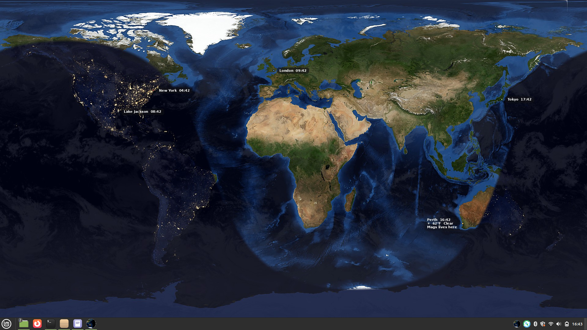
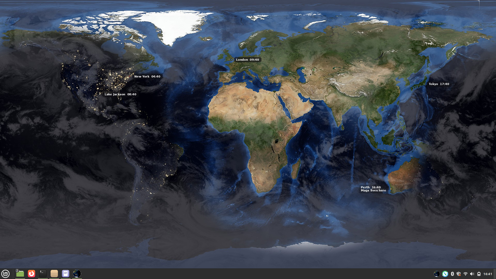
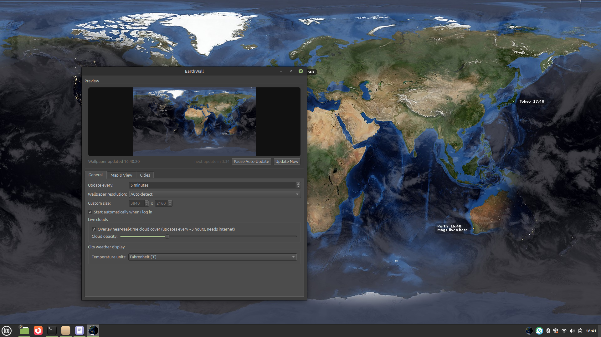
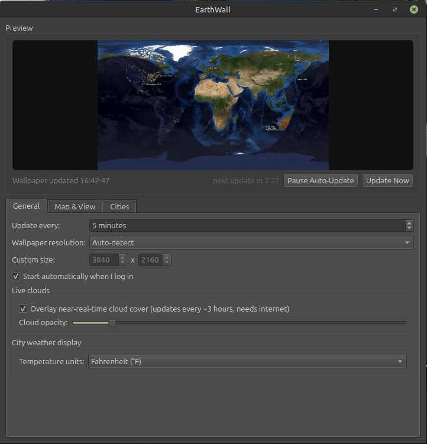
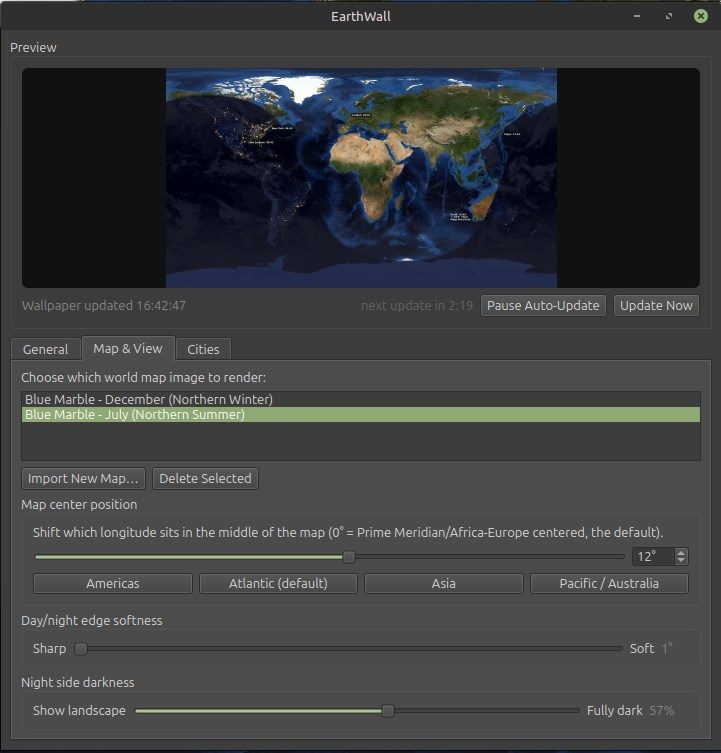
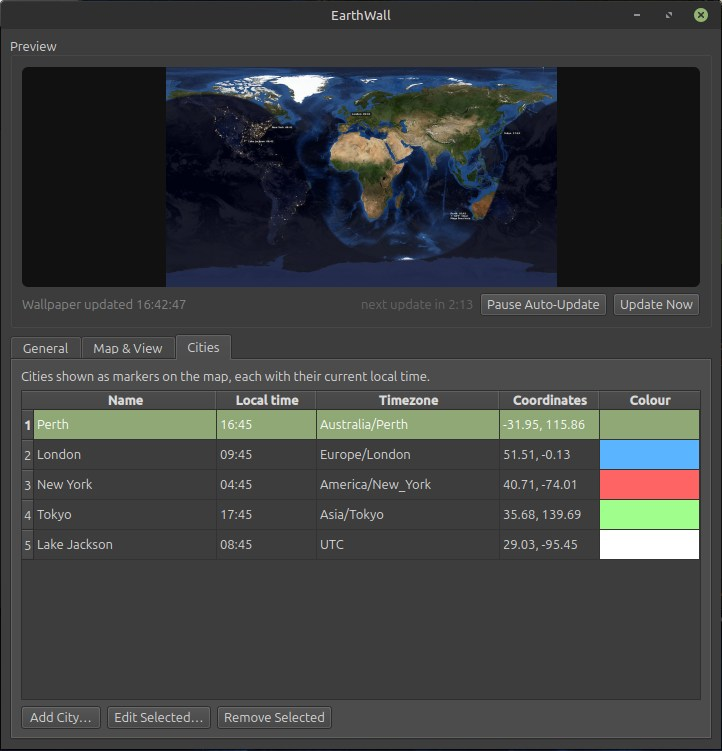

# EarthWall

A live, real-time Earth wallpaper for Linux: flat equirectangular map,
astronomically accurate day/night terminator, night-side city lights,
labeled markers showing the current local time in cities you choose, and
now a proper desktop app to manage it all.

Built as a Linux-native alternative to DeskSoft's EarthView, using real
NASA Blue Marble / Black Marble imagery.

## Screenshots

### Desktop wallpaper examples






### Application interface

**General tab**



**Map & Views tab**



**Cities tab**



## What's in the GUI

- **Live preview** of the current render, with a one-click "Update Now",
  a pause/resume toggle, and a countdown to the next automatic update.
  The preview re-renders instantly (at low resolution) whenever you
  change any setting, with a busy indicator while it works.
- **Flicker-free wallpaper updates** - renders are written atomically and
  alternate between two files, so the image your desktop is displaying is
  never touched mid-write. No more flash-to-black transitions; you get
  your desktop environment's normal near-instant wallpaper swap.
- **Map picker** - switch between the bundled seasonal maps (July/December
  Blue Marble), or **import your own** day/night image pair. Almost any
  image format works (JPEG, PNG, BMP, TIFF, WEBP, GIF) - it's decoded and
  converted automatically. If you only supply a day map, the bundled
  night-lights map is paired with it automatically.
- **Map re-centering** - a slider/spinner to shift which longitude sits
  in the middle of the map, with quick presets (Americas, Atlantic, Asia,
  Pacific/Australia).
- **Day/night edge softness slider** - from a crisp terminator line to a
  wide, soft dusk band.
- **City manager** - add/edit/remove city markers through a proper form,
  with a searchable built-in database of ~130 major cities (pick one and
  its coordinates/timezone fill in automatically) plus full manual entry
  for anywhere not listed. The city list shows each city's live local
  time, ticking in real time, and clustered cities' map labels
  automatically spread out instead of overlapping.
- **Live cloud overlay** (optional) - a free, near-real-time global cloud
  layer that updates every ~3 hours, with an opacity slider. If a refresh
  fails (offline, service hiccup), the last good cloud layer keeps being
  used rather than clouds blinking off.
- **Runs from the system tray** - closing the window just hides it; the
  wallpaper keeps auto-updating in the background. Right-click the tray
  icon for quick actions.
- **Start at login** - one checkbox, no manual systemd setup required.

## Install

```bash
cd earthwall
python3 -m venv venv
source venv/bin/activate
pip install -r requirements.txt
```

## Run it

```bash
./run_gui.sh
```

(or, equivalently: `source venv/bin/activate && python -m earthwall.gui`)

The first launch also adds EarthWall to your applications menu, so after
that first run you can just search for "EarthWall" in your app launcher
like any other program - no terminal needed.

A tray icon appears (a little cropped globe). The settings window opens
automatically the first time; after that, click the tray icon to
show/hide it. Use the **General** tab to turn on "Start automatically
when I log in" once you're happy with your setup.

## Adding cities

Cities tab → **Add City…** → start typing a name in the search box (e.g.
"Tokyo") and pick it from the suggestions - coordinates and timezone
fill in automatically. Pick a marker colour and hit OK. For a city not
in the built-in list, just fill in the name/latitude/longitude/timezone
fields directly (run `timedatectl list-timezones` in a terminal if you
need to look up the exact timezone name).

## Adding your own map

Map & View tab → **Import New Map…** → choose a day-view image (ideally
a flat, 2:1 width:height equirectangular map - the app will gently warn
you if the aspect ratio looks unusual, but won't stop you). A night map
is optional. Give it a name and hit OK - it becomes another entry in the
map list, selectable and deletable like any other (built-in maps can't
be deleted).

## Advanced / headless use (no GUI)

The original command-line tool still works standalone, useful for
servers or scripting:

```bash
python -m earthwall.cli --once --no-wallpaper --output ~/test.png
python -m earthwall.cli --interval 300   # run as a foreground daemon
```

See `python -m earthwall.cli --help` for all options. It reads/writes
the same `~/.config/earthwall/cities.json` the GUI uses, so switching
between the two is seamless.

## How it works

- `earthwall/sun.py` calculates the "subsolar point" (where the sun is
  directly overhead) using the standard NOAA solar position formulas.
- `earthwall/render.py` blends the day and night maps together across a
  soft twilight band along the terminator, optionally re-centers the map
  on a chosen longitude, layers in live clouds if enabled, and draws city
  markers on top.
- `earthwall/maps.py` manages built-in and user-imported map sets, and
  handles decoding/validating whatever image format you throw at it.
- `earthwall/clouds.py` fetches the optional live cloud layer, failing
  quietly (and falling back to a cached copy) if there's no internet.
- `earthwall/wallpaper.py` detects your desktop environment (GNOME, KDE
  Plasma, XFCE, Cinnamon, MATE, or a generic X11 WM) and sets the
  rendered image as your wallpaper the right way for each.
- `earthwall/gui.py` + `earthwall/gui_main_window.py` are the PySide6
  desktop app: a system tray icon plus a settings window, with renders
  running on a background thread so the UI never freezes.
- `earthwall/autostart.py` manages the XDG autostart entry (login) and
  application-menu entry (launcher), both via standard `.desktop` files
  that work across desktop environments.

## Attribution

Day and night map imagery is NASA's public-domain "Blue Marble" and
"Black Marble" (city lights) datasets. The optional live cloud layer is
sourced from the free live-cloud-maps project
(https://github.com/matteason/live-cloud-maps), built on public satellite
data.
